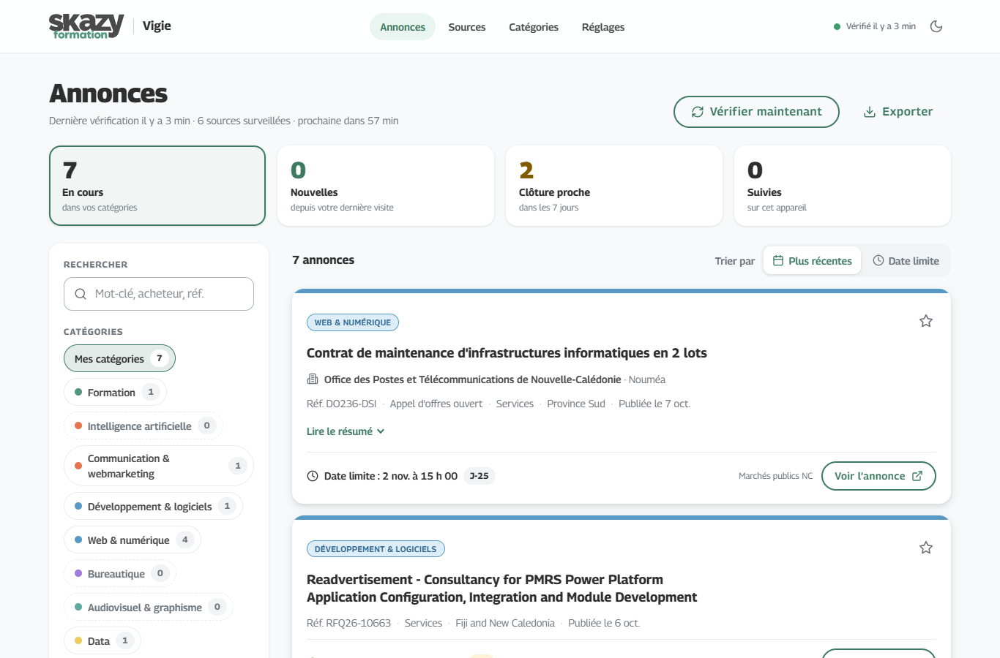
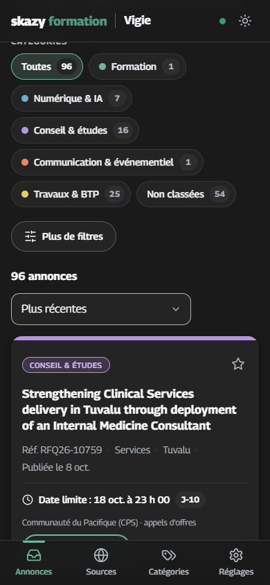

# Vigie — veille des appels d’offres

Vigie surveille automatiquement les appels d’offres publiés en Nouvelle-Calédonie, à Wallis-et-Futuna, en Polynésie française et au Vanuatu, ainsi que toutes les pages web que vous lui confiez. Les nouveautés sont classées par catégories, signalées dans l’interface et, si vous le souhaitez, envoyées par e-mail.

**Version en ligne : <https://gharel.github.io/scraping/>**

| Bureau | Mobile (thème sombre) |
| --- | --- |
|  |  |

Interface conçue avec le design system **Skazy Formation** (Claude Design) : logo officiel en SVG, police Georama, vert `#50967c`, couleurs de catégories du design system, boutons pill, cartes à barre de couleur. Responsive, thème clair et sombre.

Chaque outil Skazy Formation a sa couleur de l’arc-en-ciel, dans cet ordre : Quiz rouge, Mini-jeux orange, Vigie jaune, Atelier d’exercices IA vert, Comprendre l'IA bleu, Prompthèque violet. Le favicon de Vigie (des jumelles blanches sur un dégradé jaune) sert aussi de pastille dans le bandeau : logo Skazy Formation, filet, pastille, nom de l’outil ; `node scripts/generate-icons.js` en dérive les icônes PNG. Titre d’onglet : « Page · Vigie · Skazy Formation ».

## Ce que fait Vigie

- **Surveille** 32 sources (portails de marchés publics, provinces, communes, établissements publics, journaux d’annonces légales) toutes les 2 heures (en ligne) ou toutes les heures (sur votre PC).
- **Lit les consultations en détail** : acheteur, référence, procédure, nature, nombre de lots, date de publication, date limite. Quand la liste ne donne que l’acheteur, Vigie lit la fiche de l’annonce pour en connaître l’objet.
- **Range** chaque annonce par territoire (Nouvelle-Calédonie, Polynésie française, Wallis-et-Futuna, Vanuatu, Pacifique), avec un filtre dédié.
- **Classe** chaque annonce dans vos domaines (formation, IA, communication, développement, web, bureautique, audiovisuel, data, gestion de projet) et **écarte** le BTP grâce à des mots-clés exclus. Par défaut, seules les annonces de vos catégories sont affichées.
- **Signale** les nouveautés (elles le restent jusqu’à ce que vous les marquiez comme lues), les clôtures proches (compte à rebours J-n) et les reports de date limite.
- **Alerte par e-mail** via un ticket GitHub quand une nouvelle annonce entre dans vos catégories.
- **Exporte** les annonces affichées en CSV (Excel).

## Sources surveillées par défaut

**Nouvelle-Calédonie**

| Source | Type | Contenu |
| --- | --- | --- |
| [Marchés publics NC](https://portail.marchespublics.nc/?page=Entreprise.EntrepriseAdvancedSearch&AllCons) | Portail Atexo | Toutes les consultations en cours (Gouvernement, provinces, communes, établissements publics) |
| [Province Nord](https://marchespublics.province-nord.nc/sallemarche.aspx) | Liste CSS | Salle des marchés : objet, direction, référence, nature, date limite |
| [Province Sud · commande publique](https://www.province-sud.nc/recherche?classNaturalName=Appel%20d%27offres) | Liste CSS | Avis d’appel d’offres et d’attribution |
| [Province Sud · appels à projets](https://www.province-sud.nc/aaps/feed/) | Flux RSS | Appels à projets |
| [Province des Îles](https://www.province-iles.nc/appel-offres) | Page web (liens) | Avis publiés en PDF |
| [Haut-commissariat](https://www.nouvelle-caledonie.gouv.fr/Publications/Marches-publics) | Page web (liens) | Avis de l’État, fiche lue pour la date de publication |
| [Les Nouvelles Calédoniennes](https://legales.lnc.nc/categorie/appels-doffres-950) | Page web (liens) | Annonces légales d’appels d’offres, objet lu sur la fiche |
| [IFAP](https://www.ifap.nc/consultations) | Liste CSS | Consultations de formateurs (catégorie Formation imposée) |
| [FIAF](https://www.fiaf.nc/prestataires-de-formation/acces-a-l-espace-consultations) | Flux RSS | Consultations de prestataires de formation (catégorie Formation imposée) |
| [CAFAT](https://www.cafat.nc/nos-marches/), [FSH](https://www.fsh.nc/appels-offres/) | Flux RSS | Marchés de ces organismes |
| [SECAL](https://secal.nc/nos-appels-doffres/) | Liste CSS | Avis de la SECAL (référence, maître d’ouvrage, dates) |
| [CCI](https://www.cci.nc/la-cci-nc/appels-d-offres-et-consultations), [CHT](https://www.cht.nc/les-appels-d-offres/appels-d-offres-en-cours/), [SIC](https://www.sic.nc/nos-appels-doffre/), [UNC](https://unc.nc/utile/appel-doffres/) | Page web (liens) | Nouveaux avis et dossiers publiés |
| Villes de [Dumbéa](https://www.ville-dumbea.nc/dumbea-pratique/marches-publics/), [Koné](https://www.koohne.nc/les-marches-publics/), [Koumac](https://www.mairie-koumac.nc/marches-publics), [Mont-Dore](https://www.mont-dore.nc/marches-publics) | Page web (liens) | Nouveaux avis et dossiers publiés |
| [Nouméa](https://www.noumea.nc/noumea-pratique/appel-offres), [Enercal](https://www.enercal.nc/espace-sous-traitants/), [OPT-NC](https://office.opt.nc/fr/marches-publics/appels-offre), [informations marchespublics.nc](https://marchespublics.nc/accueil) | Page web (texte) | Toute modification de la page |

**Wallis-et-Futuna, Polynésie française, Vanuatu et Pacifique**

| Source | Type | Contenu |
| --- | --- | --- |
| [Wallis-et-Futuna](https://www.wallis-et-futuna.gouv.fr/Publications/Appels-d-offres-Avis-d-attribution-des-marches) | Page web (liens) | Avis de l’Administration supérieure : objet, référence, date limite |
| [Lexpol](https://lexpol.cloud.pf/LexpolMarchesPublics.php?3) | Page web (liens) | Avis de marchés publiés en Polynésie française |
| [Haut-commissariat de Polynésie](https://www.polynesie-francaise.gouv.fr/Publications/Publications-legales-et-avis/Marches-publics) | Page web (liens) | Avis de l’État en Polynésie |
| [Port autonome de Papeete](https://www.portdepapeete.pf/marches-publics/) | Page web (liens) | Marchés et appels à projets du port |
| [Central Tender Board](https://ctb.gov.vu/en/tenders/actual-tenders), [Public Works Department](https://pwd.gov.vu/procurements/procurements-page) | Flux RSS | Appels d’offres du Vanuatu |
| [Marchés publics de l’État (PLACE)](https://www.marches-publics.gouv.fr/) | Portail Atexo | Consultations de l’État exécutées en Nouvelle-Calédonie, Polynésie, Wallis-et-Futuna ou au Vanuatu |
| [Communauté du Pacifique (CPS)](https://www.spc.int/procurement) | Liste CSS | Appels d’offres ouverts de la CPS (siège à Nouméa) |

Les pages de la Ville de Nouméa, d’Enercal et de l’OPT n’ayant pas de liste exploitable, Vigie y signale toute modification.

**Sites hors de portée en ligne.** Quelques sites refusent les connexions venant des serveurs de GitHub, qui assurent la veille en ligne (filtrage des connexions étrangères) : Haut-commissariats de Nouvelle-Calédonie et de Polynésie, Wallis-et-Futuna, Lexpol, Mont-Dore et Province des Îles. Vigie lancé sur votre PC les lit normalement et, avec le [relais](#relayer-les-sites-hors-de-portée-vers-la-version-en-ligne), publie leurs annonces sur la version en ligne : elles y apparaissent « Relayée depuis votre PC · il y a 1 h ». Sans relevé récent (PC éteint depuis plus de 6 heures, relais désactivé), ils apparaissent « Hors de portée en ligne » dans l’onglet Sources. Les avis de l’État (Haut-commissariats, Wallis-et-Futuna) sont de toute façon publiés sur PLACE, suivi en ligne. Le Gouvernement de la Nouvelle-Calédonie et la plupart des communes publient sur marchespublics.nc, déjà couvert.

## Accès réservé

Un **mot de passe** est demandé avant d’afficher la veille (le même que les mini-jeux et le quiz Skazy Formation), en ligne comme sur votre PC. Le navigateur s’en souvient ensuite ; « Verrouiller l’accès » (Réglages, carte « Sur cet appareil ») le fait redemander. Chaque mot de passe incorrect bloque la saisie sur ce navigateur, de plus en plus longtemps : 5 minutes, 1 heure, 24 heures, 1 semaine, 1 mois, puis définitivement ; le bon mot de passe remet le compte à zéro.

Seule une empreinte PBKDF2 (SHA-256, 600 000 itérations) est publiée, dans `site/assets/js/access.js`. C’est une protection dissuasive : le site reste statique et ses données publiques.

## Utiliser Vigie

- **Annonces** : les tuiles du haut filtrent en un clic (en cours, nouvelles, clôture proche, suivies). Toutes les options de filtre sont des puces avec leur nombre d’annonces : catégories (« Mes catégories » par défaut, « Toutes » pour tout voir), statut, territoire, source, type ; le tri se fait par date de publication ou par date limite. L’étoile « suit » une annonce sur l’appareil. Une annonce reste « Nouvelle » tant que vous ne l’avez pas marquée comme lue : bouton « Marquer comme lue » sur la carte, ou « Tout marquer comme lu » au-dessus de la liste (nouveautés de la sélection affichée) et dans Réglages (toutes). La notification qui suit propose « Annuler ». Comme les annonces suivies, la lecture est retenue sur l’appareil.
- **Sources** : rangées par territoire, avec l’état de chaque vérification (à jour, relayée depuis votre PC, hors de portée en ligne, erreur, en pause), ajout et modification.
- **Catégories** : mots-clés de classement, avec aperçu en direct des annonces trouvées.
- **Réglages** : thème, connexion GitHub, relais (sur le PC), alertes, fréquence, export.

### Modifier la veille depuis la version en ligne

La version en ligne est en consultation seule tant que vous n’avez pas connecté GitHub sur l’appareil :

1. Dans **Réglages**, cliquez sur « Créer le jeton sur GitHub ».
2. Choisissez le dépôt `gharel/scraping` uniquement, avec les autorisations **Contents** et **Actions** en lecture et écriture.
3. Collez le jeton dans Vigie. Il reste stocké dans ce navigateur uniquement.

Chaque modification crée un commit sur `config/veille.json` ; la veille relance alors une vérification et republie le site en 1 à 2 minutes. Le bouton « Vérifier maintenant » déclenche une vérification immédiate.

Sans jeton, vous pouvez aussi modifier [config/veille.json](config/veille.json) directement sur GitHub.

### Recevoir les alertes par e-mail

À chaque passage, s’il y a de nouvelles annonces dans vos catégories, Vigie ouvre un ticket (issue) étiqueté `veille` sur le dépôt. GitHub vous l’envoie par e-mail si vous suivez le dépôt (bouton **Watch** > *All Activity*, ou *Custom* > *Issues*). Les alertes se désactivent dans **Réglages**.

## Lancer Vigie sur votre PC

Prérequis : [Node.js](https://nodejs.org) 20 ou plus récent.

```bash
git clone https://github.com/gharel/scraping.git vigie
cd vigie
npm install
npm start
```

L’interface s’ouvre sur <http://localhost:4700>. En local, vous pouvez **tester une source** avant de l’ajouter, et les modifications sont enregistrées directement dans `config/veille.json` (à pousser sur GitHub pour les partager avec la version en ligne). Les données locales sont rangées dans `local-data/`, séparées des données publiées.

Sous Windows :

- `scripts\windows\demarrer-vigie.cmd` lance Vigie d’un double-clic ;
- `scripts\windows\installer-demarrage.ps1` le lance automatiquement à chaque ouverture de session (tâche planifiée « Vigie ») ;
- `scripts\windows\desinstaller-demarrage.ps1` retire ce démarrage automatique.

### Relayer les sites hors de portée vers la version en ligne

Les sites qui filtrent les serveurs de GitHub restent lisibles depuis votre PC. Le relais publie leurs annonces sur la version en ligne :

1. Lancez Vigie sur votre PC (`npm start`), onglet **Réglages**, carte « Relais vers la version en ligne ».
2. Cliquez sur « Créer le jeton sur GitHub » : dépôt `gharel/scraping` uniquement, autorisation **Contents** en lecture et écriture. Le jeton créé pour la version en ligne convient aussi.
3. Collez le jeton et cliquez sur « Activer le relais ». Vigie vérifie le jeton (sans rien modifier dans le dépôt) puis publie aussitôt.

Ensuite, après chaque vérification faite sur le PC :

- Vigie lit l’état de la version en ligne (`data/status.json` publié avec le site) pour savoir quels sites GitHub n’atteint pas ;
- il publie leurs annonces dans `data/relais/<source>.json` (annonces actuelles, date du relevé), **en un seul commit** « Relais : annonces lues depuis le PC (…) » ;
- un relevé inchangé n’est republié qu’au bout de 3 heures, pour rester récent sans créer un commit à chaque passage. « Publier maintenant » force la publication.

À son passage suivant (toutes les 2 heures), la veille en ligne essaie toujours de lire le site directement. Si GitHub reste bloqué et que le relevé du PC a moins de 6 heures, elle fusionne ses annonces comme si elle les avait lues : mêmes clés, donc pas de doublon ni de fausse nouveauté, et les vraies nouveautés déclenchent l’alerte par e-mail. Un relevé plus ancien, ou fait sur une autre adresse que celle de la source, est ignoré.

Le jeton est enregistré sur le PC dans `local-data/relais.json` (dossier ignoré par git). Il n’est jamais affiché, ni écrit dans le journal, ni servi par l’interface locale. « Désactiver le relais » le supprime.

## Ajouter une source

| Type | Pour quoi | Ce qu’il faut fournir |
| --- | --- | --- |
| `atexo` | marchespublics.nc et les plateformes Atexo | L’adresse de la liste des consultations (recherche avancée) |
| `rss` | Flux RSS ou Atom | L’adresse du flux (souvent `/feed/`, ou `?format=feed&type=rss` sur Joomla) |
| `page` | N’importe quelle page web | Mode `texte` (modifications) ou `liens` (chaque lien est une annonce) ; zone CSS facultative |
| `liste` | Liste d’annonces sans flux | Sélecteurs CSS de l’annonce et de ses champs (`selecteur@attribut` pour lire un attribut) |

Chaque source porte un **territoire** (`region` : `nc`, `pf`, `wf`, `vu` ou `pacifique`). Pour une source régionale (`pacifique`), chaque annonce est rattachée au territoire cité dans son lieu d’exécution ou son titre.

Options utiles (`options`) :

| Type | Option | Effet |
| --- | --- | --- |
| `atexo` | `lieux`, `motsCles` | Recherche avancée limitée à des lieux d’exécution (codes Atexo) ou à des mots-clés |
| `atexo` | `lieuxMax` | Écarte les marchés nationaux qui citent plus de N lieux |
| `page` | `match`, `exclude` | Expressions régulières : liens à garder, liens à écarter |
| `page`, `liste` | `keep` | La page ne montre que les derniers avis : une annonce qui en sort n’est pas retirée |
| `page` | `details`, `detailsTitle` | Lit sur la fiche de chaque annonce le texte de ce sélecteur (une seule fois par annonce) ; avec `detailsTitle`, il devient le titre |
| `liste` | `fields.status` | Un statut « Expirée », « Clôturée » ou « Closed » ferme l’annonce |

Exemple dans `config/veille.json` :

```json
{
  "id": "ma-source",
  "name": "Mon acheteur",
  "url": "https://exemple.nc/appels-d-offres/",
  "type": "page",
  "region": "nc",
  "enabled": true,
  "categories": [],
  "options": { "detect": "liens", "selector": "main", "match": "\\.pdf$" }
}
```

En mode `liens`, Vigie choisit le titre le plus parlant : le texte du lien, son contexte (ligne de tableau, paragraphe) ou l’intertitre de l’avis (« Avis de marché : … ») quand le lien ne dit que « Télécharger ». Un avis lié deux fois (vignette, puis titre) prend le titre du lien et le résumé de la vignette. Certains liens ne sont jamais des annonces, même s’ils passent le filtre `match` : ceux qui mènent à une page d’accueil ou de rubrique (« …/marches-publics », « /appels-d-offres?page=2 ») et les renvois vers un autre site glissés dans une phrase (« … sur le site internet de la province Nord »). Les pages construites entièrement en JavaScript ne sont pas lisibles : préférez alors leur flux RSS s’il existe.

## Catégories et mots-clés

Catégories livrées, avec les couleurs de catégories du design system Skazy Formation :

| Catégorie | Couleur | Exemples de mots-clés |
| --- | --- | --- |
| Formation | vert | formation\*, pédagogi\*, e-learning, LMS, training\* |
| Intelligence artificielle | orange | intelligence artificielle, IA, chatbot\*, automatisation\*, no-code |
| Communication & webmarketing | orange | plan de communication, réseaux sociaux, événementiel\*, magazine\*, goodies |
| Développement & logiciels | bleu | développement web, logiciel\*, application mobile, ERP, API |
| Web & numérique | bleu | site internet, informatique\*, transformation numérique, cybersécurité, serveur\* |
| Bureautique | violet | bureautique, Microsoft 365, Google Workspace, Excel |
| Audiovisuel & graphisme | turquoise | audiovisuel\*, vidéo, court métrage, motion design, graphis\*, UX |
| Data | jaune | data, tableau de bord, Power BI, statistique\* |
| Gestion de projet | rose | gestion de projet, conduite du changement, agile, Opquast |

Règles :

- Les accents et les majuscules sont ignorés.
- Un mot-clé trouve le mot entier : « audit » ne trouve pas « auditorium ».
- Une étoile finale inclut les variantes : `format*` trouve formation, formateur, formations…
- Un sigle écrit en majuscules (`IA`, `ERP`) ne trouve que ce sigle en majuscules.
- Seul l’objet de l’annonce compte (titre, résumé, nature), pas le nom de l’acheteur.
- Une source peut imposer des catégories à toutes ses annonces.

**Mots-clés exclus** (`settings.excludeKeywords`) : une annonce qui contient « travaux », « BTP », « génie civil », « voirie »… n’entre dans aucune catégorie, n’apparaît pas dans « Mes catégories » et ne déclenche pas d’alerte. La liste se modifie en bas de l’onglet Catégories.

## Fonctionnement

```
Vigie sur votre PC (toutes les heures, relais activé)
  └─ commit             data/relais/<source>.json pour les sites que GitHub n'atteint pas

GitHub Actions (toutes les 2 h)
  └─ npm run scrape     lit les sources, met à jour data/items.json et data/status.json
                        (site injoignable : relevé du PC repris s'il a moins de 6 h)
  └─ commit             seulement si les annonces ont changé
  └─ alerte             ticket GitHub si nouveautés dans vos catégories
  └─ npm run build      assemble _site/ (interface + données + configuration)
  └─ GitHub Pages       publie https://gharel.github.io/scraping/
```

| Dossier | Contenu |
| --- | --- |
| `config/veille.json` | Sources, catégories et réglages |
| `data/` | Annonces connues, état des sources, état des pages surveillées, relevés relayés par le PC (`data/relais/`) |
| `scraper/` | Moteur de veille (Node.js) : lecteurs Atexo, RSS, liste CSS, page web |
| `server/` | Serveur local (`npm start`) : interface, API, vérifications planifiées et relais |
| `site/` | Interface web (HTML, CSS, JavaScript sans compilation) |
| `scripts/` | Publication du site, icônes, démarrage automatique sous Windows |
| `test/` | Tests automatisés (`npm test`) |

Commandes utiles :

```bash
npm test                            # tests
npm run scrape                      # une vérification complète (données dans data/)
npm run scrape -- --only cafat-marches
npm run build                       # prépare _site/ pour GitHub Pages
```

## Bon usage

Vigie consulte des pages publiques, à faible fréquence, avec une pause entre deux requêtes. Gardez des intervalles raisonnables et respectez les conditions d’utilisation des sites surveillés.
